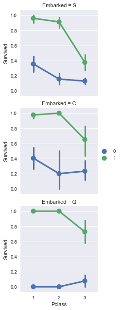
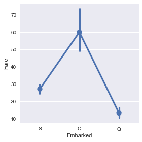

# Titanic Survival

## Data source
- https://www.kaggle.com/c/titanic/data

## References
- http://scikit-learn.org/stable/modules/tree.html#tree-algorithms-id3-c4-5-c5-0-and-cart
- http://chrisstrelioff.ws/sandbox/2015/06/08/decision_trees_in_python_with_scikit_learn_and_pandas.html
- https://www.kaggle.com/startupsci/titanic-data-science-solutions
- http://scikit-learn.org/stable/auto_examples/linear_model/plot_iris_logistic.html
- http://scikit-learn.org/stable/modules/ensemble.html
- http://scikit-learn.org/stable/modules/svm.html#support-vector-machines
- https://en.wikipedia.org/wiki/Support_vector_machine

### Modules


```python
import pandas as pd
import numpy as np
import random
import seaborn as sns
import matplotlib.pyplot as plt
%matplotlib inline

from sklearn.linear_model import LogisticRegression
from sklearn.svm import SVC
from sklearn.tree import DecisionTreeClassifier, export_graphviz
from sklearn.ensemble import RandomForestClassifier
```

### Import data


```python
train = pd.read_csv('train.csv')
test = pd.read_csv('test.csv')
submission = pd.read_csv('gender_submission.csv')
complete = [train, test]
```

### Describe data


```python
train.head()
```


<div>
<table border="1" class="dataframe">
  <thead>
    <tr style="text-align: right;">
      <th></th>
      <th>PassengerId</th>
      <th>Survived</th>
      <th>Pclass</th>
      <th>Name</th>
      <th>Sex</th>
      <th>Age</th>
      <th>SibSp</th>
      <th>Parch</th>
      <th>Ticket</th>
      <th>Fare</th>
      <th>Cabin</th>
      <th>Embarked</th>
    </tr>
  </thead>
  <tbody>
    <tr>
      <th>0</th>
      <td>1</td>
      <td>0</td>
      <td>3</td>
      <td>Braund, Mr. Owen Harris</td>
      <td>male</td>
      <td>22.0</td>
      <td>1</td>
      <td>0</td>
      <td>A/5 21171</td>
      <td>7.2500</td>
      <td>NaN</td>
      <td>S</td>
    </tr>
    <tr>
      <th>1</th>
      <td>2</td>
      <td>1</td>
      <td>1</td>
      <td>Cumings, Mrs. John Bradley (Florence Briggs Th...</td>
      <td>female</td>
      <td>38.0</td>
      <td>1</td>
      <td>0</td>
      <td>PC 17599</td>
      <td>71.2833</td>
      <td>C85</td>
      <td>C</td>
    </tr>
    <tr>
      <th>2</th>
      <td>3</td>
      <td>1</td>
      <td>3</td>
      <td>Heikkinen, Miss. Laina</td>
      <td>female</td>
      <td>26.0</td>
      <td>0</td>
      <td>0</td>
      <td>STON/O2. 3101282</td>
      <td>7.9250</td>
      <td>NaN</td>
      <td>S</td>
    </tr>
    <tr>
      <th>3</th>
      <td>4</td>
      <td>1</td>
      <td>1</td>
      <td>Futrelle, Mrs. Jacques Heath (Lily May Peel)</td>
      <td>female</td>
      <td>35.0</td>
      <td>1</td>
      <td>0</td>
      <td>113803</td>
      <td>53.1000</td>
      <td>C123</td>
      <td>S</td>
    </tr>
    <tr>
      <th>4</th>
      <td>5</td>
      <td>0</td>
      <td>3</td>
      <td>Allen, Mr. William Henry</td>
      <td>male</td>
      <td>35.0</td>
      <td>0</td>
      <td>0</td>
      <td>373450</td>
      <td>8.0500</td>
      <td>NaN</td>
      <td>S</td>
    </tr>
  </tbody>
</table>
</div>


```python
print(train.columns.values)
```

    ['PassengerId' 'Survived' 'Pclass' 'Name' 'Sex' 'Age' 'SibSp' 'Parch'
     'Ticket' 'Fare' 'Cabin' 'Embarked']


Features

1. Categorical Features: 
    
    - Nominal: Survived, Sex, Embarked
    - Ordinal: Pclass

2. Numerical Features:
    
    - Continuous: Age, Fare
    - Discrete: SibSp, Parch
    - Timeseries: None

3. Others: Name, Ticket, Cabin


```python
train.info()
print('-' * 40)
test.info()
```

    <class 'pandas.core.frame.DataFrame'>
    RangeIndex: 891 entries, 0 to 890
    Data columns (total 12 columns):
    PassengerId    891 non-null int64
    Survived       891 non-null int64
    Pclass         891 non-null int64
    Name           891 non-null object
    Sex            891 non-null object
    Age            714 non-null float64
    SibSp          891 non-null int64
    Parch          891 non-null int64
    Ticket         891 non-null object
    Fare           891 non-null float64
    Cabin          204 non-null object
    Embarked       889 non-null object
    dtypes: float64(2), int64(5), object(5)
    memory usage: 83.6+ KB
    ----------------------------------------
    <class 'pandas.core.frame.DataFrame'>
    RangeIndex: 418 entries, 0 to 417
    Data columns (total 11 columns):
    PassengerId    418 non-null int64
    Pclass         418 non-null int64
    Name           418 non-null object
    Sex            418 non-null object
    Age            332 non-null float64
    SibSp          418 non-null int64
    Parch          418 non-null int64
    Ticket         418 non-null object
    Fare           417 non-null float64
    Cabin          91 non-null object
    Embarked       418 non-null object
    dtypes: float64(2), int64(4), object(5)
    memory usage: 36.0+ KB


Datatypes

    - Strings datatype: Name, Sex, Ticket, Cabin, Embarked
    - Numerical datatype: Survived, Pclass, Age, SibSp, Parch, Fare

Empty Values:
    
1. train: Age, Cabin, Embarked
2. test: Age, Fare, Cabin


```python
train.describe()
```


<div>
<table border="1" class="dataframe">
  <thead>
    <tr style="text-align: right;">
      <th></th>
      <th>PassengerId</th>
      <th>Survived</th>
      <th>Pclass</th>
      <th>Age</th>
      <th>SibSp</th>
      <th>Parch</th>
      <th>Fare</th>
    </tr>
  </thead>
  <tbody>
    <tr>
      <th>count</th>
      <td>891.000000</td>
      <td>891.000000</td>
      <td>891.000000</td>
      <td>714.000000</td>
      <td>891.000000</td>
      <td>891.000000</td>
      <td>891.000000</td>
    </tr>
    <tr>
      <th>mean</th>
      <td>446.000000</td>
      <td>0.383838</td>
      <td>2.308642</td>
      <td>29.699118</td>
      <td>0.523008</td>
      <td>0.381594</td>
      <td>32.204208</td>
    </tr>
    <tr>
      <th>std</th>
      <td>257.353842</td>
      <td>0.486592</td>
      <td>0.836071</td>
      <td>14.526497</td>
      <td>1.102743</td>
      <td>0.806057</td>
      <td>49.693429</td>
    </tr>
    <tr>
      <th>min</th>
      <td>1.000000</td>
      <td>0.000000</td>
      <td>1.000000</td>
      <td>0.420000</td>
      <td>0.000000</td>
      <td>0.000000</td>
      <td>0.000000</td>
    </tr>
    <tr>
      <th>25%</th>
      <td>223.500000</td>
      <td>0.000000</td>
      <td>2.000000</td>
      <td>20.125000</td>
      <td>0.000000</td>
      <td>0.000000</td>
      <td>7.910400</td>
    </tr>
    <tr>
      <th>50%</th>
      <td>446.000000</td>
      <td>0.000000</td>
      <td>3.000000</td>
      <td>28.000000</td>
      <td>0.000000</td>
      <td>0.000000</td>
      <td>14.454200</td>
    </tr>
    <tr>
      <th>75%</th>
      <td>668.500000</td>
      <td>1.000000</td>
      <td>3.000000</td>
      <td>38.000000</td>
      <td>1.000000</td>
      <td>0.000000</td>
      <td>31.000000</td>
    </tr>
    <tr>
      <th>max</th>
      <td>891.000000</td>
      <td>1.000000</td>
      <td>3.000000</td>
      <td>80.000000</td>
      <td>8.000000</td>
      <td>6.000000</td>
      <td>512.329200</td>
    </tr>
  </tbody>
</table>
</div>


```python
train.describe(include=['O'])
```


<div>
<table border="1" class="dataframe">
  <thead>
    <tr style="text-align: right;">
      <th></th>
      <th>Name</th>
      <th>Sex</th>
      <th>Ticket</th>
      <th>Cabin</th>
      <th>Embarked</th>
    </tr>
  </thead>
  <tbody>
    <tr>
      <th>count</th>
      <td>891</td>
      <td>891</td>
      <td>891</td>
      <td>204</td>
      <td>889</td>
    </tr>
    <tr>
      <th>unique</th>
      <td>891</td>
      <td>2</td>
      <td>681</td>
      <td>147</td>
      <td>3</td>
    </tr>
    <tr>
      <th>top</th>
      <td>Frolicher, Miss. Hedwig Margaritha</td>
      <td>male</td>
      <td>347082</td>
      <td>G6</td>
      <td>S</td>
    </tr>
    <tr>
      <th>freq</th>
      <td>1</td>
      <td>577</td>
      <td>7</td>
      <td>4</td>
      <td>644</td>
    </tr>
  </tbody>
</table>
</div>


### Feature Engineering

#### 1. Pclass
    
    - class 1 has higher survival rate ~62%
    - class 3 has low survival rate ~24%
    - High correlation between Pclass and Survived, include the feature Pclass


```python
sns.factorplot(
    x='Pclass',
    y='Survived',
    data=train,
    kind='bar'
)
```


    <seaborn.axisgrid.FacetGrid at 0x11b0aa0f0>


```python
train[['Pclass', 'Survived']].groupby(['Pclass'], as_index=False).mean().sort_values(by='Survived', ascending=False)
```


<div>
<table border="1" class="dataframe">
  <thead>
    <tr style="text-align: right;">
      <th></th>
      <th>Pclass</th>
      <th>Survived</th>
    </tr>
  </thead>
  <tbody>
    <tr>
      <th>0</th>
      <td>1</td>
      <td>0.629630</td>
    </tr>
    <tr>
      <th>1</th>
      <td>2</td>
      <td>0.472826</td>
    </tr>
    <tr>
      <th>2</th>
      <td>3</td>
      <td>0.242363</td>
    </tr>
  </tbody>
</table>
</div>


```python
_.corr()
```


<div>
<table border="1" class="dataframe">
  <thead>
    <tr style="text-align: right;">
      <th></th>
      <th>Pclass</th>
      <th>Survived</th>
    </tr>
  </thead>
  <tbody>
    <tr>
      <th>Pclass</th>
      <td>1.000000</td>
      <td>-0.994024</td>
    </tr>
    <tr>
      <th>Survived</th>
      <td>-0.994024</td>
      <td>1.000000</td>
    </tr>
  </tbody>
</table>
</div>


Pclass = 1 survived more, Pclass = 3 survived less; however lots of Pclass = 3 infants survived. And lots of Pclass = 3 aged 15-30 people died


```python
grid_1 = sns.FacetGrid(train, col='Survived', row='Pclass')
grid_1.map(plt.hist, 'Age', bins=20)
```


    <seaborn.axisgrid.FacetGrid at 0x11d5fc630>


#### 2. Gender (Sex)

    - female has much higher survival rate
    - high correlation between Sex and Survived, include the feature Sex
    - create mapping for Sex


```python
sns.factorplot(
    x='Sex',
    y='Survived',
    data=train,
    kind='bar'
)
```


    <seaborn.axisgrid.FacetGrid at 0x11d634320>


```python
train[['Sex', 'Survived']].groupby(['Sex'], as_index=False).mean().sort_values(by='Survived', ascending=False)
```


<div>
<table border="1" class="dataframe">
  <thead>
    <tr style="text-align: right;">
      <th></th>
      <th>Sex</th>
      <th>Survived</th>
    </tr>
  </thead>
  <tbody>
    <tr>
      <th>0</th>
      <td>female</td>
      <td>0.742038</td>
    </tr>
    <tr>
      <th>1</th>
      <td>male</td>
      <td>0.188908</td>
    </tr>
  </tbody>
</table>
</div>


```python
gender_mapping = {
    'male': 0,
    'female': 1
}

for dataset in complete:
    dataset['Sex'] = dataset['Sex'].map(gender_mapping).astype(np.int)
    
train.head()
```


<div>
<table border="1" class="dataframe">
  <thead>
    <tr style="text-align: right;">
      <th></th>
      <th>PassengerId</th>
      <th>Survived</th>
      <th>Pclass</th>
      <th>Name</th>
      <th>Sex</th>
      <th>Age</th>
      <th>SibSp</th>
      <th>Parch</th>
      <th>Ticket</th>
      <th>Fare</th>
      <th>Cabin</th>
      <th>Embarked</th>
    </tr>
  </thead>
  <tbody>
    <tr>
      <th>0</th>
      <td>1</td>
      <td>0</td>
      <td>3</td>
      <td>Braund, Mr. Owen Harris</td>
      <td>0</td>
      <td>22.0</td>
      <td>1</td>
      <td>0</td>
      <td>A/5 21171</td>
      <td>7.2500</td>
      <td>NaN</td>
      <td>S</td>
    </tr>
    <tr>
      <th>1</th>
      <td>2</td>
      <td>1</td>
      <td>1</td>
      <td>Cumings, Mrs. John Bradley (Florence Briggs Th...</td>
      <td>1</td>
      <td>38.0</td>
      <td>1</td>
      <td>0</td>
      <td>PC 17599</td>
      <td>71.2833</td>
      <td>C85</td>
      <td>C</td>
    </tr>
    <tr>
      <th>2</th>
      <td>3</td>
      <td>1</td>
      <td>3</td>
      <td>Heikkinen, Miss. Laina</td>
      <td>1</td>
      <td>26.0</td>
      <td>0</td>
      <td>0</td>
      <td>STON/O2. 3101282</td>
      <td>7.9250</td>
      <td>NaN</td>
      <td>S</td>
    </tr>
    <tr>
      <th>3</th>
      <td>4</td>
      <td>1</td>
      <td>1</td>
      <td>Futrelle, Mrs. Jacques Heath (Lily May Peel)</td>
      <td>1</td>
      <td>35.0</td>
      <td>1</td>
      <td>0</td>
      <td>113803</td>
      <td>53.1000</td>
      <td>C123</td>
      <td>S</td>
    </tr>
    <tr>
      <th>4</th>
      <td>5</td>
      <td>0</td>
      <td>3</td>
      <td>Allen, Mr. William Henry</td>
      <td>0</td>
      <td>35.0</td>
      <td>0</td>
      <td>0</td>
      <td>373450</td>
      <td>8.0500</td>
      <td>NaN</td>
      <td>S</td>
    </tr>
  </tbody>
</table>
</div>


#### 3. SibSp / Parch (IsAlone)

    - people alone has lower survival rate
    - though people not alone has higher survival rate, but the rate varies a lot as well
    - high to moderate correlation between SibSb / Parch and Survived, include the features
    - Combine existing 'SibSp' and 'Parch' to create new feature


```python
sns.factorplot(
    x='SibSp',
    y='Survived',
    data=train,
    kind='bar'
)
```


    <seaborn.axisgrid.FacetGrid at 0x11e026dd8>


```python
train[['SibSp', 'Survived']].groupby(['SibSp'], as_index=False).mean().sort_values(by='Survived', ascending=False)
```


<div>
<table border="1" class="dataframe">
  <thead>
    <tr style="text-align: right;">
      <th></th>
      <th>SibSp</th>
      <th>Survived</th>
    </tr>
  </thead>
  <tbody>
    <tr>
      <th>1</th>
      <td>1</td>
      <td>0.535885</td>
    </tr>
    <tr>
      <th>2</th>
      <td>2</td>
      <td>0.464286</td>
    </tr>
    <tr>
      <th>0</th>
      <td>0</td>
      <td>0.345395</td>
    </tr>
    <tr>
      <th>3</th>
      <td>3</td>
      <td>0.250000</td>
    </tr>
    <tr>
      <th>4</th>
      <td>4</td>
      <td>0.166667</td>
    </tr>
    <tr>
      <th>5</th>
      <td>5</td>
      <td>0.000000</td>
    </tr>
    <tr>
      <th>6</th>
      <td>8</td>
      <td>0.000000</td>
    </tr>
  </tbody>
</table>
</div>


```python
_.corr()
```


<div>
<table border="1" class="dataframe">
  <thead>
    <tr style="text-align: right;">
      <th></th>
      <th>SibSp</th>
      <th>Survived</th>
    </tr>
  </thead>
  <tbody>
    <tr>
      <th>SibSp</th>
      <td>1.000000</td>
      <td>-0.851638</td>
    </tr>
    <tr>
      <th>Survived</th>
      <td>-0.851638</td>
      <td>1.000000</td>
    </tr>
  </tbody>
</table>
</div>


```python
sns.factorplot(
    x='Parch',
    y='Survived',
    data=train,
    kind='bar'
)
```


    <seaborn.axisgrid.FacetGrid at 0x11e09c2e8>


```python
train[['Parch', 'Survived']].groupby(['Parch'], as_index=False).mean().sort_values(by='Survived', ascending=False)
```


<div>
<table border="1" class="dataframe">
  <thead>
    <tr style="text-align: right;">
      <th></th>
      <th>Parch</th>
      <th>Survived</th>
    </tr>
  </thead>
  <tbody>
    <tr>
      <th>3</th>
      <td>3</td>
      <td>0.600000</td>
    </tr>
    <tr>
      <th>1</th>
      <td>1</td>
      <td>0.550847</td>
    </tr>
    <tr>
      <th>2</th>
      <td>2</td>
      <td>0.500000</td>
    </tr>
    <tr>
      <th>0</th>
      <td>0</td>
      <td>0.343658</td>
    </tr>
    <tr>
      <th>5</th>
      <td>5</td>
      <td>0.200000</td>
    </tr>
    <tr>
      <th>4</th>
      <td>4</td>
      <td>0.000000</td>
    </tr>
    <tr>
      <th>6</th>
      <td>6</td>
      <td>0.000000</td>
    </tr>
  </tbody>
</table>
</div>


```python
_.corr()
```


<div>
<table border="1" class="dataframe">
  <thead>
    <tr style="text-align: right;">
      <th></th>
      <th>Parch</th>
      <th>Survived</th>
    </tr>
  </thead>
  <tbody>
    <tr>
      <th>Parch</th>
      <td>1.000000</td>
      <td>-0.681289</td>
    </tr>
    <tr>
      <th>Survived</th>
      <td>-0.681289</td>
      <td>1.000000</td>
    </tr>
  </tbody>
</table>
</div>


Binning/Converting Numerical to Categorical Variable, reducing noise or non-linearity, referencing [Enhance Machine Learning with Standardizing, Binning, Reducing](http://data-informed.com/enhance-machine-learning-with-standardizing-binning-reducing/)


```python
for dataset in complete:
    dataset['FamilySize'] = dataset['SibSp'] + dataset['Parch'] + 1
    
train[['FamilySize', 'Survived']].groupby(['FamilySize'], as_index=False).mean()
```


<div>
<table border="1" class="dataframe">
  <thead>
    <tr style="text-align: right;">
      <th></th>
      <th>FamilySize</th>
      <th>Survived</th>
    </tr>
  </thead>
  <tbody>
    <tr>
      <th>0</th>
      <td>1</td>
      <td>0.303538</td>
    </tr>
    <tr>
      <th>1</th>
      <td>2</td>
      <td>0.552795</td>
    </tr>
    <tr>
      <th>2</th>
      <td>3</td>
      <td>0.578431</td>
    </tr>
    <tr>
      <th>3</th>
      <td>4</td>
      <td>0.724138</td>
    </tr>
    <tr>
      <th>4</th>
      <td>5</td>
      <td>0.200000</td>
    </tr>
    <tr>
      <th>5</th>
      <td>6</td>
      <td>0.136364</td>
    </tr>
    <tr>
      <th>6</th>
      <td>7</td>
      <td>0.333333</td>
    </tr>
    <tr>
      <th>7</th>
      <td>8</td>
      <td>0.000000</td>
    </tr>
    <tr>
      <th>8</th>
      <td>11</td>
      <td>0.000000</td>
    </tr>
  </tbody>
</table>
</div>


```python
for dataset in complete:
    dataset['IsAlone'] = 0
    dataset.loc[dataset['FamilySize'] == 1, 'IsAlone'] = 1

train[['IsAlone', 'Survived']].groupby(['IsAlone'], as_index=False).mean()
```


<div>
<table border="1" class="dataframe">
  <thead>
    <tr style="text-align: right;">
      <th></th>
      <th>IsAlone</th>
      <th>Survived</th>
    </tr>
  </thead>
  <tbody>
    <tr>
      <th>0</th>
      <td>0</td>
      <td>0.505650</td>
    </tr>
    <tr>
      <th>1</th>
      <td>1</td>
      <td>0.303538</td>
    </tr>
  </tbody>
</table>
</div>


```python
train = train.drop(['SibSp', 'Parch', 'FamilySize'], axis=1)
test = test.drop(['SibSp', 'Parch', 'FamilySize'], axis=1)
complete = [train, test]

train.head()
```


<div>
<table border="1" class="dataframe">
  <thead>
    <tr style="text-align: right;">
      <th></th>
      <th>PassengerId</th>
      <th>Survived</th>
      <th>Pclass</th>
      <th>Name</th>
      <th>Sex</th>
      <th>Age</th>
      <th>Ticket</th>
      <th>Fare</th>
      <th>Cabin</th>
      <th>Embarked</th>
      <th>IsAlone</th>
    </tr>
  </thead>
  <tbody>
    <tr>
      <th>0</th>
      <td>1</td>
      <td>0</td>
      <td>3</td>
      <td>Braund, Mr. Owen Harris</td>
      <td>0</td>
      <td>22.0</td>
      <td>A/5 21171</td>
      <td>7.2500</td>
      <td>NaN</td>
      <td>S</td>
      <td>0</td>
    </tr>
    <tr>
      <th>1</th>
      <td>2</td>
      <td>1</td>
      <td>1</td>
      <td>Cumings, Mrs. John Bradley (Florence Briggs Th...</td>
      <td>1</td>
      <td>38.0</td>
      <td>PC 17599</td>
      <td>71.2833</td>
      <td>C85</td>
      <td>C</td>
      <td>0</td>
    </tr>
    <tr>
      <th>2</th>
      <td>3</td>
      <td>1</td>
      <td>3</td>
      <td>Heikkinen, Miss. Laina</td>
      <td>1</td>
      <td>26.0</td>
      <td>STON/O2. 3101282</td>
      <td>7.9250</td>
      <td>NaN</td>
      <td>S</td>
      <td>1</td>
    </tr>
    <tr>
      <th>3</th>
      <td>4</td>
      <td>1</td>
      <td>1</td>
      <td>Futrelle, Mrs. Jacques Heath (Lily May Peel)</td>
      <td>1</td>
      <td>35.0</td>
      <td>113803</td>
      <td>53.1000</td>
      <td>C123</td>
      <td>S</td>
      <td>0</td>
    </tr>
    <tr>
      <th>4</th>
      <td>5</td>
      <td>0</td>
      <td>3</td>
      <td>Allen, Mr. William Henry</td>
      <td>0</td>
      <td>35.0</td>
      <td>373450</td>
      <td>8.0500</td>
      <td>NaN</td>
      <td>S</td>
      <td>1</td>
    </tr>
  </tbody>
</table>
</div>


#### 4. Age

    - Infants survived more, lots of 15-30 people died, include the feature Age
    - Guess age based on Pclass and gender with age median values
    - Also tried using obviously out-of-range value -1 for NA, no big difference though
    


```python
facet = sns.FacetGrid(
    data=train,
    hue='Survived',
    aspect=4
)
facet.map(sns.kdeplot, 'Age', shade=True)
facet.set(xlim=(0, train['Age'].max()))
facet.add_legend()
```


    <seaborn.axisgrid.FacetGrid at 0x11e370c88>


```python
grid_3 = sns.FacetGrid(train, row='Pclass', col='Sex')
grid_3.map(plt.hist, 'Age')
grid_3.add_legend()
```


    <seaborn.axisgrid.FacetGrid at 0x11e2e7518>


```python
#  Also tried using obviously out-of-range value -1 for NA, no big difference though
# for dataset in complete:
    # dataset['Age'].fillna(-1.0, inplace=True)

for dataset in complete:
    
    guess_ages = np.zeros((2, 3))
    
    for i in range(0, 2):
        for j in range(0, 3):
            guess = dataset[(dataset['Sex'] == i) & (dataset['Pclass'] == j+1)]['Age'].dropna().median()
            guess_ages[i, j] = guess
            
    for i in range(0, 2):
        for j in range(0, 3):
            dataset.loc[
                (dataset['Age'].isnull()) & (dataset['Sex'] == i) & (dataset['Pclass'] == j+1),
                'Age'
            ] = guess_ages[i, j]
            
            
    dataset['Age'] = dataset['Age'].astype(np.int)
```


Binning/Converting Numerical to Categorical Variable, reducing noise or non-linearity, referencing [Enhance Machine Learning with Standardizing, Binning, Reducing](http://data-informed.com/enhance-machine-learning-with-standardizing-binning-reducing/)


```python
# get bin from train data
train['AgeBin'], age_bin = pd.cut(train['Age'], 5, retbins=True)
train['AgeBin'] = train['AgeBin'].astype(str)
age_group = train[['AgeBin', 'Survived']].groupby(['AgeBin'], as_index=False).mean()
age_group
```


<div>
<table border="1" class="dataframe">
  <thead>
    <tr style="text-align: right;">
      <th></th>
      <th>AgeBin</th>
      <th>Survived</th>
    </tr>
  </thead>
  <tbody>
    <tr>
      <th>0</th>
      <td>(-0.08, 16]</td>
      <td>0.550000</td>
    </tr>
    <tr>
      <th>1</th>
      <td>(16, 32]</td>
      <td>0.337374</td>
    </tr>
    <tr>
      <th>2</th>
      <td>(32, 48]</td>
      <td>0.412037</td>
    </tr>
    <tr>
      <th>3</th>
      <td>(48, 64]</td>
      <td>0.434783</td>
    </tr>
    <tr>
      <th>4</th>
      <td>(64, 80]</td>
      <td>0.090909</td>
    </tr>
  </tbody>
</table>
</div>


```python
# apply the bin to test data
test['AgeBin'] = pd.cut(test['Age'], bins=age_bin)
test['AgeBin'] = test['AgeBin'].astype(str)
```


```python
# acquire mapping for age bin
age_bin_map = {v: k for k, v in age_group.to_dict()['AgeBin'].items()}
age_bin_map
```


    {'(-0.08, 16]': 0, '(16, 32]': 1, '(32, 48]': 2, '(48, 64]': 3, '(64, 80]': 4}


```python
for dataset in complete:
    
    dataset['Age'] = dataset['AgeBin'].map(age_bin_map).astype(np.int)
    
train = train.drop('AgeBin', axis=1)
test = test.drop('AgeBin', axis=1)
complete = [train, test]
train.head()
```


<div>
<table border="1" class="dataframe">
  <thead>
    <tr style="text-align: right;">
      <th></th>
      <th>PassengerId</th>
      <th>Survived</th>
      <th>Pclass</th>
      <th>Name</th>
      <th>Sex</th>
      <th>Age</th>
      <th>Ticket</th>
      <th>Fare</th>
      <th>Cabin</th>
      <th>Embarked</th>
      <th>IsAlone</th>
    </tr>
  </thead>
  <tbody>
    <tr>
      <th>0</th>
      <td>1</td>
      <td>0</td>
      <td>3</td>
      <td>Braund, Mr. Owen Harris</td>
      <td>0</td>
      <td>1</td>
      <td>A/5 21171</td>
      <td>7.2500</td>
      <td>NaN</td>
      <td>S</td>
      <td>0</td>
    </tr>
    <tr>
      <th>1</th>
      <td>2</td>
      <td>1</td>
      <td>1</td>
      <td>Cumings, Mrs. John Bradley (Florence Briggs Th...</td>
      <td>1</td>
      <td>2</td>
      <td>PC 17599</td>
      <td>71.2833</td>
      <td>C85</td>
      <td>C</td>
      <td>0</td>
    </tr>
    <tr>
      <th>2</th>
      <td>3</td>
      <td>1</td>
      <td>3</td>
      <td>Heikkinen, Miss. Laina</td>
      <td>1</td>
      <td>1</td>
      <td>STON/O2. 3101282</td>
      <td>7.9250</td>
      <td>NaN</td>
      <td>S</td>
      <td>1</td>
    </tr>
    <tr>
      <th>3</th>
      <td>4</td>
      <td>1</td>
      <td>1</td>
      <td>Futrelle, Mrs. Jacques Heath (Lily May Peel)</td>
      <td>1</td>
      <td>2</td>
      <td>113803</td>
      <td>53.1000</td>
      <td>C123</td>
      <td>S</td>
      <td>0</td>
    </tr>
    <tr>
      <th>4</th>
      <td>5</td>
      <td>0</td>
      <td>3</td>
      <td>Allen, Mr. William Henry</td>
      <td>0</td>
      <td>2</td>
      <td>373450</td>
      <td>8.0500</td>
      <td>NaN</td>
      <td>S</td>
      <td>1</td>
    </tr>
  </tbody>
</table>
</div>


#### 5. Name

    - Create new feature 'Title' based on 'Name' using all the datasets, and drop 'Name'
    - also tried dropping Name directly without getting further info, no big difference


```python
# also tried dropping Name directly without getting further info, no big difference
# for dataset in complete:
    # dataset = dataset.drop(['Name'], axis=1)

for dataset in complete:
    # expand=True to return dataframe
    dataset['Title'] = dataset['Name'].str.extract('([A-Za-z]+)\.', expand=True) 
    
train.head()
```


<div>
<table border="1" class="dataframe">
  <thead>
    <tr style="text-align: right;">
      <th></th>
      <th>PassengerId</th>
      <th>Survived</th>
      <th>Pclass</th>
      <th>Name</th>
      <th>Sex</th>
      <th>Age</th>
      <th>Ticket</th>
      <th>Fare</th>
      <th>Cabin</th>
      <th>Embarked</th>
      <th>IsAlone</th>
      <th>Title</th>
    </tr>
  </thead>
  <tbody>
    <tr>
      <th>0</th>
      <td>1</td>
      <td>0</td>
      <td>3</td>
      <td>Braund, Mr. Owen Harris</td>
      <td>0</td>
      <td>1</td>
      <td>A/5 21171</td>
      <td>7.2500</td>
      <td>NaN</td>
      <td>S</td>
      <td>0</td>
      <td>Mr</td>
    </tr>
    <tr>
      <th>1</th>
      <td>2</td>
      <td>1</td>
      <td>1</td>
      <td>Cumings, Mrs. John Bradley (Florence Briggs Th...</td>
      <td>1</td>
      <td>2</td>
      <td>PC 17599</td>
      <td>71.2833</td>
      <td>C85</td>
      <td>C</td>
      <td>0</td>
      <td>Mrs</td>
    </tr>
    <tr>
      <th>2</th>
      <td>3</td>
      <td>1</td>
      <td>3</td>
      <td>Heikkinen, Miss. Laina</td>
      <td>1</td>
      <td>1</td>
      <td>STON/O2. 3101282</td>
      <td>7.9250</td>
      <td>NaN</td>
      <td>S</td>
      <td>1</td>
      <td>Miss</td>
    </tr>
    <tr>
      <th>3</th>
      <td>4</td>
      <td>1</td>
      <td>1</td>
      <td>Futrelle, Mrs. Jacques Heath (Lily May Peel)</td>
      <td>1</td>
      <td>2</td>
      <td>113803</td>
      <td>53.1000</td>
      <td>C123</td>
      <td>S</td>
      <td>0</td>
      <td>Mrs</td>
    </tr>
    <tr>
      <th>4</th>
      <td>5</td>
      <td>0</td>
      <td>3</td>
      <td>Allen, Mr. William Henry</td>
      <td>0</td>
      <td>2</td>
      <td>373450</td>
      <td>8.0500</td>
      <td>NaN</td>
      <td>S</td>
      <td>1</td>
      <td>Mr</td>
    </tr>
  </tbody>
</table>
</div>


```python
pd.crosstab(train['Title'], train['Sex'])
```


<div>
<table border="1" class="dataframe">
  <thead>
    <tr style="text-align: right;">
      <th>Sex</th>
      <th>0</th>
      <th>1</th>
    </tr>
    <tr>
      <th>Title</th>
      <th></th>
      <th></th>
    </tr>
  </thead>
  <tbody>
    <tr>
      <th>Capt</th>
      <td>1</td>
      <td>0</td>
    </tr>
    <tr>
      <th>Col</th>
      <td>2</td>
      <td>0</td>
    </tr>
    <tr>
      <th>Countess</th>
      <td>0</td>
      <td>1</td>
    </tr>
    <tr>
      <th>Don</th>
      <td>1</td>
      <td>0</td>
    </tr>
    <tr>
      <th>Dr</th>
      <td>6</td>
      <td>1</td>
    </tr>
    <tr>
      <th>Jonkheer</th>
      <td>1</td>
      <td>0</td>
    </tr>
    <tr>
      <th>Lady</th>
      <td>0</td>
      <td>1</td>
    </tr>
    <tr>
      <th>Major</th>
      <td>2</td>
      <td>0</td>
    </tr>
    <tr>
      <th>Master</th>
      <td>40</td>
      <td>0</td>
    </tr>
    <tr>
      <th>Miss</th>
      <td>0</td>
      <td>182</td>
    </tr>
    <tr>
      <th>Mlle</th>
      <td>0</td>
      <td>2</td>
    </tr>
    <tr>
      <th>Mme</th>
      <td>0</td>
      <td>1</td>
    </tr>
    <tr>
      <th>Mr</th>
      <td>517</td>
      <td>0</td>
    </tr>
    <tr>
      <th>Mrs</th>
      <td>0</td>
      <td>125</td>
    </tr>
    <tr>
      <th>Ms</th>
      <td>0</td>
      <td>1</td>
    </tr>
    <tr>
      <th>Rev</th>
      <td>6</td>
      <td>0</td>
    </tr>
    <tr>
      <th>Sir</th>
      <td>1</td>
      <td>0</td>
    </tr>
  </tbody>
</table>
</div>


Reducing Levels in Categorical Variables, referencing [Enhance Machine Learning with Standardizing, Binning, Reducing](http://data-informed.com/enhance-machine-learning-with-standardizing-binning-reducing/)


```python
for dataset in complete:
    dataset['Title'] = dataset['Title'].replace([
        'Capt', 'Col', 'Countess', 'Don', 'Dona', 'Dr',
        'Jonkheer', 'Lady', 'Major', 'Rev', 'Sir'
    ], 'Others')
    dataset['Title'] = dataset['Title'].replace('Mlle', 'Miss')
    dataset['Title'] = dataset['Title'].replace('Ms', 'Miss')
    dataset['Title'] = dataset['Title'].replace('Mme', 'Mrs')
    
train[['Title', 'Survived']].groupby(['Title'], as_index=False).mean()
```


<div>
<table border="1" class="dataframe">
  <thead>
    <tr style="text-align: right;">
      <th></th>
      <th>Title</th>
      <th>Survived</th>
    </tr>
  </thead>
  <tbody>
    <tr>
      <th>0</th>
      <td>Master</td>
      <td>0.575000</td>
    </tr>
    <tr>
      <th>1</th>
      <td>Miss</td>
      <td>0.702703</td>
    </tr>
    <tr>
      <th>2</th>
      <td>Mr</td>
      <td>0.156673</td>
    </tr>
    <tr>
      <th>3</th>
      <td>Mrs</td>
      <td>0.793651</td>
    </tr>
    <tr>
      <th>4</th>
      <td>Others</td>
      <td>0.347826</td>
    </tr>
  </tbody>
</table>
</div>


Create mapping for 'Title', convert categorical titles into ordinal


```python
title_mapping = {
    'Mr': 1,
    'Miss': 2,
    'Mrs': 3,
    'Master': 4,
    'Others': 5
}
for dataset in complete:
    dataset['Title'] = dataset['Title'].map(title_mapping).astype(np.int)
```


```python
train.head()
```


<div>
<table border="1" class="dataframe">
  <thead>
    <tr style="text-align: right;">
      <th></th>
      <th>PassengerId</th>
      <th>Survived</th>
      <th>Pclass</th>
      <th>Name</th>
      <th>Sex</th>
      <th>Age</th>
      <th>Ticket</th>
      <th>Fare</th>
      <th>Cabin</th>
      <th>Embarked</th>
      <th>IsAlone</th>
      <th>Title</th>
    </tr>
  </thead>
  <tbody>
    <tr>
      <th>0</th>
      <td>1</td>
      <td>0</td>
      <td>3</td>
      <td>Braund, Mr. Owen Harris</td>
      <td>0</td>
      <td>1</td>
      <td>A/5 21171</td>
      <td>7.2500</td>
      <td>NaN</td>
      <td>S</td>
      <td>0</td>
      <td>1</td>
    </tr>
    <tr>
      <th>1</th>
      <td>2</td>
      <td>1</td>
      <td>1</td>
      <td>Cumings, Mrs. John Bradley (Florence Briggs Th...</td>
      <td>1</td>
      <td>2</td>
      <td>PC 17599</td>
      <td>71.2833</td>
      <td>C85</td>
      <td>C</td>
      <td>0</td>
      <td>3</td>
    </tr>
    <tr>
      <th>2</th>
      <td>3</td>
      <td>1</td>
      <td>3</td>
      <td>Heikkinen, Miss. Laina</td>
      <td>1</td>
      <td>1</td>
      <td>STON/O2. 3101282</td>
      <td>7.9250</td>
      <td>NaN</td>
      <td>S</td>
      <td>1</td>
      <td>2</td>
    </tr>
    <tr>
      <th>3</th>
      <td>4</td>
      <td>1</td>
      <td>1</td>
      <td>Futrelle, Mrs. Jacques Heath (Lily May Peel)</td>
      <td>1</td>
      <td>2</td>
      <td>113803</td>
      <td>53.1000</td>
      <td>C123</td>
      <td>S</td>
      <td>0</td>
      <td>3</td>
    </tr>
    <tr>
      <th>4</th>
      <td>5</td>
      <td>0</td>
      <td>3</td>
      <td>Allen, Mr. William Henry</td>
      <td>0</td>
      <td>2</td>
      <td>373450</td>
      <td>8.0500</td>
      <td>NaN</td>
      <td>S</td>
      <td>1</td>
      <td>1</td>
    </tr>
  </tbody>
</table>
</div>


```python
train = train.drop(['Name', 'PassengerId'], axis=1)
test = test.drop(['Name'], axis=1)
complete = [train, test]
```


```python

```

#### 6. Embarked

    - Embarked C has higher survival rate, include feature Embarked
    - With embarked C, male has higher survival rate than female, strange, embarked might relate to Pclass
    - With Embarked = 'C' or 'S', survival rate is higher for higher fare
    - With Embarked = 'Q' survival rate is low
    - passengers with high fare rate tends to embark at port 'C', use that to fill NA 


```python
grid_4 = sns.FacetGrid(train, row='Embarked')
grid_4.map(sns.pointplot, 'Pclass', 'Survived', 'Sex', palette='deep')
grid_4.add_legend()
```


    <seaborn.axisgrid.FacetGrid at 0x11eff04a8>





```python
grid_5 = sns.FacetGrid(train, row='Embarked', col='Survived')
grid_5.map(sns.barplot, 'Sex', 'Fare')
grid_5.add_legend()
```


    <seaborn.axisgrid.FacetGrid at 0x11f129048>


```python
train[['Embarked', 'Survived']].groupby(['Embarked'], as_index=False).mean()
```


<div>
<table border="1" class="dataframe">
  <thead>
    <tr style="text-align: right;">
      <th></th>
      <th>Embarked</th>
      <th>Survived</th>
    </tr>
  </thead>
  <tbody>
    <tr>
      <th>0</th>
      <td>C</td>
      <td>0.553571</td>
    </tr>
    <tr>
      <th>1</th>
      <td>Q</td>
      <td>0.389610</td>
    </tr>
    <tr>
      <th>2</th>
      <td>S</td>
      <td>0.336957</td>
    </tr>
  </tbody>
</table>
</div>


```python
sns.factorplot(
    x='Embarked',
    y='Fare',
    data=train
)
```


    <seaborn.axisgrid.FacetGrid at 0x11f4d0b70>





```python
train.loc[(train['Embarked'].isnull())]
```


<div>
<table border="1" class="dataframe">
  <thead>
    <tr style="text-align: right;">
      <th></th>
      <th>Survived</th>
      <th>Pclass</th>
      <th>Sex</th>
      <th>Age</th>
      <th>Ticket</th>
      <th>Fare</th>
      <th>Cabin</th>
      <th>Embarked</th>
      <th>IsAlone</th>
      <th>Title</th>
    </tr>
  </thead>
  <tbody>
    <tr>
      <th>61</th>
      <td>1</td>
      <td>1</td>
      <td>1</td>
      <td>2</td>
      <td>113572</td>
      <td>80.0</td>
      <td>B28</td>
      <td>NaN</td>
      <td>1</td>
      <td>2</td>
    </tr>
    <tr>
      <th>829</th>
      <td>1</td>
      <td>1</td>
      <td>1</td>
      <td>3</td>
      <td>113572</td>
      <td>80.0</td>
      <td>B28</td>
      <td>NaN</td>
      <td>1</td>
      <td>3</td>
    </tr>
  </tbody>
</table>
</div>


```python
# high fares, let them be Embarked = 'C'
train.loc[(train['Embarked'].isnull()), 'Embarked'] = 'C'
```


```python
port_mapping = {
    'S': 0,
    'C': 1,
    'Q': 2
}

for dataset in complete:
    dataset['Embarked'] = dataset['Embarked'].map(port_mapping).astype(np.int)
    
train.head()
```


<div>
<table border="1" class="dataframe">
  <thead>
    <tr style="text-align: right;">
      <th></th>
      <th>Survived</th>
      <th>Pclass</th>
      <th>Sex</th>
      <th>Age</th>
      <th>Ticket</th>
      <th>Fare</th>
      <th>Cabin</th>
      <th>Embarked</th>
      <th>IsAlone</th>
      <th>Title</th>
    </tr>
  </thead>
  <tbody>
    <tr>
      <th>0</th>
      <td>0</td>
      <td>3</td>
      <td>0</td>
      <td>1</td>
      <td>A/5 21171</td>
      <td>7.2500</td>
      <td>NaN</td>
      <td>0</td>
      <td>0</td>
      <td>1</td>
    </tr>
    <tr>
      <th>1</th>
      <td>1</td>
      <td>1</td>
      <td>1</td>
      <td>2</td>
      <td>PC 17599</td>
      <td>71.2833</td>
      <td>C85</td>
      <td>1</td>
      <td>0</td>
      <td>3</td>
    </tr>
    <tr>
      <th>2</th>
      <td>1</td>
      <td>3</td>
      <td>1</td>
      <td>1</td>
      <td>STON/O2. 3101282</td>
      <td>7.9250</td>
      <td>NaN</td>
      <td>0</td>
      <td>1</td>
      <td>2</td>
    </tr>
    <tr>
      <th>3</th>
      <td>1</td>
      <td>1</td>
      <td>1</td>
      <td>2</td>
      <td>113803</td>
      <td>53.1000</td>
      <td>C123</td>
      <td>0</td>
      <td>0</td>
      <td>3</td>
    </tr>
    <tr>
      <th>4</th>
      <td>0</td>
      <td>3</td>
      <td>0</td>
      <td>2</td>
      <td>373450</td>
      <td>8.0500</td>
      <td>NaN</td>
      <td>0</td>
      <td>1</td>
      <td>1</td>
    </tr>
  </tbody>
</table>
</div>


#### 7. Fare


```python
test['Fare'].fillna(test['Fare'].dropna().median(), inplace=True)
```


```python
# qcut() for quantity cut

train['FareBin'], fare_bin = pd.qcut(train['Fare'], 4, retbins=True)
train['FareBin'] = train['FareBin'].astype(str)
fare_group = train[['FareBin', 'Survived']].groupby(['FareBin'], as_index=False).mean()
fare_group
```


<div>
<table border="1" class="dataframe">
  <thead>
    <tr style="text-align: right;">
      <th></th>
      <th>FareBin</th>
      <th>Survived</th>
    </tr>
  </thead>
  <tbody>
    <tr>
      <th>0</th>
      <td>(14.454, 31]</td>
      <td>0.454955</td>
    </tr>
    <tr>
      <th>1</th>
      <td>(31, 512.329]</td>
      <td>0.581081</td>
    </tr>
    <tr>
      <th>2</th>
      <td>(7.91, 14.454]</td>
      <td>0.303571</td>
    </tr>
    <tr>
      <th>3</th>
      <td>[0, 7.91]</td>
      <td>0.197309</td>
    </tr>
  </tbody>
</table>
</div>


```python
test['FareBin'] = pd.cut(test['Fare'], bins=fare_bin, include_lowest=True)
test['FareBin'] = test['FareBin'].astype(str)

fare_bin_map = {v: k for k, v in fare_group.to_dict()['FareBin'].items()}
fare_bin_map
```


    {'(14.454, 31]': 0, '(31, 512.329]': 1, '(7.91, 14.454]': 2, '[0, 7.91]': 3}


```python
for dataset in complete:

    dataset['Fare'] = dataset['FareBin'].map(fare_bin_map).astype(np.int)
    
train = train.drop(['FareBin'], axis=1)
test = test.drop(['FareBin'], axis=1)
complete = [train, test]

train.head(10)
```


<div>
<table border="1" class="dataframe">
  <thead>
    <tr style="text-align: right;">
      <th></th>
      <th>Survived</th>
      <th>Pclass</th>
      <th>Sex</th>
      <th>Age</th>
      <th>Ticket</th>
      <th>Fare</th>
      <th>Cabin</th>
      <th>Embarked</th>
      <th>IsAlone</th>
      <th>Title</th>
    </tr>
  </thead>
  <tbody>
    <tr>
      <th>0</th>
      <td>0</td>
      <td>3</td>
      <td>0</td>
      <td>1</td>
      <td>A/5 21171</td>
      <td>3</td>
      <td>NaN</td>
      <td>0</td>
      <td>0</td>
      <td>1</td>
    </tr>
    <tr>
      <th>1</th>
      <td>1</td>
      <td>1</td>
      <td>1</td>
      <td>2</td>
      <td>PC 17599</td>
      <td>1</td>
      <td>C85</td>
      <td>1</td>
      <td>0</td>
      <td>3</td>
    </tr>
    <tr>
      <th>2</th>
      <td>1</td>
      <td>3</td>
      <td>1</td>
      <td>1</td>
      <td>STON/O2. 3101282</td>
      <td>2</td>
      <td>NaN</td>
      <td>0</td>
      <td>1</td>
      <td>2</td>
    </tr>
    <tr>
      <th>3</th>
      <td>1</td>
      <td>1</td>
      <td>1</td>
      <td>2</td>
      <td>113803</td>
      <td>1</td>
      <td>C123</td>
      <td>0</td>
      <td>0</td>
      <td>3</td>
    </tr>
    <tr>
      <th>4</th>
      <td>0</td>
      <td>3</td>
      <td>0</td>
      <td>2</td>
      <td>373450</td>
      <td>2</td>
      <td>NaN</td>
      <td>0</td>
      <td>1</td>
      <td>1</td>
    </tr>
    <tr>
      <th>5</th>
      <td>0</td>
      <td>3</td>
      <td>0</td>
      <td>1</td>
      <td>330877</td>
      <td>2</td>
      <td>NaN</td>
      <td>2</td>
      <td>1</td>
      <td>1</td>
    </tr>
    <tr>
      <th>6</th>
      <td>0</td>
      <td>1</td>
      <td>0</td>
      <td>3</td>
      <td>17463</td>
      <td>1</td>
      <td>E46</td>
      <td>0</td>
      <td>1</td>
      <td>1</td>
    </tr>
    <tr>
      <th>7</th>
      <td>0</td>
      <td>3</td>
      <td>0</td>
      <td>0</td>
      <td>349909</td>
      <td>0</td>
      <td>NaN</td>
      <td>0</td>
      <td>0</td>
      <td>4</td>
    </tr>
    <tr>
      <th>8</th>
      <td>1</td>
      <td>3</td>
      <td>1</td>
      <td>1</td>
      <td>347742</td>
      <td>2</td>
      <td>NaN</td>
      <td>0</td>
      <td>0</td>
      <td>3</td>
    </tr>
    <tr>
      <th>9</th>
      <td>1</td>
      <td>2</td>
      <td>1</td>
      <td>0</td>
      <td>237736</td>
      <td>0</td>
      <td>NaN</td>
      <td>1</td>
      <td>0</td>
      <td>3</td>
    </tr>
  </tbody>
</table>
</div>


```python
test.head(10)
```


<div>
<table border="1" class="dataframe">
  <thead>
    <tr style="text-align: right;">
      <th></th>
      <th>PassengerId</th>
      <th>Pclass</th>
      <th>Sex</th>
      <th>Age</th>
      <th>Ticket</th>
      <th>Fare</th>
      <th>Cabin</th>
      <th>Embarked</th>
      <th>IsAlone</th>
      <th>Title</th>
    </tr>
  </thead>
  <tbody>
    <tr>
      <th>0</th>
      <td>892</td>
      <td>3</td>
      <td>0</td>
      <td>2</td>
      <td>330911</td>
      <td>3</td>
      <td>NaN</td>
      <td>2</td>
      <td>1</td>
      <td>1</td>
    </tr>
    <tr>
      <th>1</th>
      <td>893</td>
      <td>3</td>
      <td>1</td>
      <td>2</td>
      <td>363272</td>
      <td>3</td>
      <td>NaN</td>
      <td>0</td>
      <td>0</td>
      <td>3</td>
    </tr>
    <tr>
      <th>2</th>
      <td>894</td>
      <td>2</td>
      <td>0</td>
      <td>3</td>
      <td>240276</td>
      <td>2</td>
      <td>NaN</td>
      <td>2</td>
      <td>1</td>
      <td>1</td>
    </tr>
    <tr>
      <th>3</th>
      <td>895</td>
      <td>3</td>
      <td>0</td>
      <td>1</td>
      <td>315154</td>
      <td>2</td>
      <td>NaN</td>
      <td>0</td>
      <td>1</td>
      <td>1</td>
    </tr>
    <tr>
      <th>4</th>
      <td>896</td>
      <td>3</td>
      <td>1</td>
      <td>1</td>
      <td>3101298</td>
      <td>2</td>
      <td>NaN</td>
      <td>0</td>
      <td>0</td>
      <td>3</td>
    </tr>
    <tr>
      <th>5</th>
      <td>897</td>
      <td>3</td>
      <td>0</td>
      <td>0</td>
      <td>7538</td>
      <td>2</td>
      <td>NaN</td>
      <td>0</td>
      <td>1</td>
      <td>1</td>
    </tr>
    <tr>
      <th>6</th>
      <td>898</td>
      <td>3</td>
      <td>1</td>
      <td>1</td>
      <td>330972</td>
      <td>3</td>
      <td>NaN</td>
      <td>2</td>
      <td>1</td>
      <td>2</td>
    </tr>
    <tr>
      <th>7</th>
      <td>899</td>
      <td>2</td>
      <td>0</td>
      <td>1</td>
      <td>248738</td>
      <td>0</td>
      <td>NaN</td>
      <td>0</td>
      <td>0</td>
      <td>1</td>
    </tr>
    <tr>
      <th>8</th>
      <td>900</td>
      <td>3</td>
      <td>1</td>
      <td>1</td>
      <td>2657</td>
      <td>3</td>
      <td>NaN</td>
      <td>1</td>
      <td>1</td>
      <td>3</td>
    </tr>
    <tr>
      <th>9</th>
      <td>901</td>
      <td>3</td>
      <td>0</td>
      <td>1</td>
      <td>A/4 48871</td>
      <td>0</td>
      <td>NaN</td>
      <td>0</td>
      <td>0</td>
      <td>1</td>
    </tr>
  </tbody>
</table>
</div>


#### 8. Cabin / Ticket

    - Drop unnecessary features
    - Cabin: contains many missing values
    - Ticket: high ratio of duplicates, might contain noise and should not correlate to survival


```python
train = train.drop(['Ticket', 'Cabin'], axis=1)
test = test.drop(['Ticket', 'Cabin'], axis=1)
complete = [train, test]
```

##### Pearson Correlation Heatmap

Gender and title and most correlated to survival, they're also highly correlated to each other


```python
plt.figure(figsize=(12,12))
plt.title('Pearson Correlation of Features', y=1.05, size=15)
sns.heatmap(
    train.astype(float).corr(),
    linewidths=0.1,
    vmax=1.0,
    square=True,
    cmap=plt.cm.afmhot,
    linecolor='white',
    annot=True
)
```


    <matplotlib.axes._subplots.AxesSubplot at 0x11efe92e8>


### Modeling


```python
X_train = train.drop(['Survived'], axis=1)
Y_train = train['Survived']
x_test = test.drop(['PassengerId'], axis=1)
```

##### Logistic Regression


```python
logreg_clf = LogisticRegression()
logreg_clf.fit(X_train, Y_train)

logreg_accuracy = round(logreg_clf.score(X_train, Y_train) * 100, 2)
logreg_accuracy
```


    81.260000000000005


```python
# Export csv and submit to Kaggle

submission['Survived'] = logreg_clf.predict(x_test)
submission.to_csv('gender_submission_logreg.csv', index=False)

# 0.76555
```

##### Support Vector Machine


```python
svm_clf = SVC(
    C=1.0,
    cache_size=200,
    class_weight=None,
    coef0=0.0,
    degree=2,
    decision_function_shape=None,
    gamma=0.1,
    kernel='rbf',
    max_iter=-1,
    probability=False,
    random_state=None,
    shrinking=True,
    tol=0.001,
    verbose=False
)
svm_clf = svm_clf.fit(X_train, Y_train)

svm_accuracy = round(svm_clf.score(X_train, Y_train) * 100, 2)
svm_accuracy
```


    82.150000000000006


```python
# Export csv and submit to Kaggle

submission['Survived'] = svm_clf.predict(x_test)
submission.to_csv('gender_submission_svm.csv', index=False)

# 0.78947
```

##### Decision Tree


```python
tree_clf = DecisionTreeClassifier(
    criterion='gini',
    max_depth=5,
    min_samples_split=2,
    min_samples_leaf=1
)
tree_clf = tree_clf.fit(X_train, Y_train)

tree_accuracy = round(tree_clf.score(X_train, Y_train) * 100, 2)
tree_accuracy
```


    83.5


- Draw the Decision Tree
- The result tells us that title has the most information gain in the first level of the tree
- How to interpret the graph: http://www.techtrek.io/machine-learning-part-2-visualizing-a-decision-tree/


```python
import pydotplus
from IPython.display import Image

dot_data = export_graphviz(
    tree_clf,
    out_file=None,
    feature_names=X_train.columns.values,
    class_names=['Not Survived', 'Survived'],
    filled=True,
    rounded=True,
    special_characters=True
)
graph = pydotplus.graph_from_dot_data(dot_data)
Image(graph.create_png())
```


```python
# Export csv and submit to Kaggle

submission['Survived'] = tree_clf.predict(x_test)
submission.to_csv('gender_submission_tree.csv', index=False)

# 0.77033
```

##### Random Forest


```python
forest_clf = RandomForestClassifier(
    n_estimators=100,
    criterion='gini',
    max_features=2,
    max_depth=None,
    min_samples_split=2,
    min_samples_leaf=1,
    bootstrap=True
)
forest_clf = forest_clf.fit(X_train, Y_train)

forest_accuracy = round(forest_clf.score(X_train, Y_train) * 100, 2)
forest_accuracy
```


    86.760000000000005


```python
importances = forest_clf.feature_importances_
print(importances)
importance_rank = np.argsort(importances)[::-1]
```

    [ 0.17672101  0.22831623  0.10399382  0.12212439  0.06761081  0.03678045
      0.26445329]


```python
sns.barplot(
    x='Features',
    y='Importance',
    data=pd.DataFrame(
        {
            'Features': list(train.columns[1:]),
            'Importance': [importances[r] for r in importance_rank]
        }
    )
)
```


    <matplotlib.axes._subplots.AxesSubplot at 0x1207e76d8>


From Random Forest, Pclass and gender are among the most important features of survival


```python
# Export csv and submit to Kaggle

submission['Survived'] = forest_clf.predict(x_test)
submission.to_csv('gender_submission_forest.csv', index=False)

# 0.78469
```

### Model Evaluation


```python
models = pd.DataFrame({
    'Model': ['Logistic Regression', 'Supprt Vector Machine', 'Decision Tree', 'Random Forest'],
    'Confidence': [logreg_accuracy, svm_accuracy, tree_accuracy, forest_accuracy],
    'Score': [0.76555, 0.78947, 0.77033, 0.78469]
})

models = models[['Model', 'Confidence', 'Score']]

models.sort_values(by='Score', ascending=False)
```


<div>
<table border="1" class="dataframe">
  <thead>
    <tr style="text-align: right;">
      <th></th>
      <th>Model</th>
      <th>Confidence</th>
      <th>Score</th>
    </tr>
  </thead>
  <tbody>
    <tr>
      <th>1</th>
      <td>Supprt Vector Machine</td>
      <td>82.15</td>
      <td>0.78947</td>
    </tr>
    <tr>
      <th>3</th>
      <td>Random Forest</td>
      <td>86.76</td>
      <td>0.78469</td>
    </tr>
    <tr>
      <th>2</th>
      <td>Decision Tree</td>
      <td>83.50</td>
      <td>0.77033</td>
    </tr>
    <tr>
      <th>0</th>
      <td>Logistic Regression</td>
      <td>81.26</td>
      <td>0.76555</td>
    </tr>
  </tbody>
</table>
</div>


